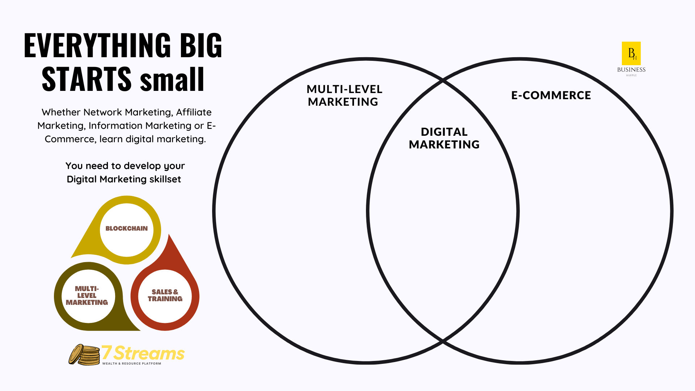

import Bleed from 'nextra-theme-docs/bleed'

# Get Started

## LET US HELP YOU START TO EARN AN ONLINE INCOME 

You can start by creating your own account online by clicking the following link to register :

You will receive a welcome email once the account is active and ready for use. Be sure to read each individual terms & conditions of each link.

## GETTING STARTED WITH 7- STREAMS

**7 Streams** by Business Hustle© is a wealth creation platform for those interested in business opportunities built to give you the resources you need to jumpstart your project and enable you to earn a monthly income.

On this page you will receive online tools, resources and  proven technique used by digital businesses globally, from startups to global corporations, to generate income from traffic on their website, mobile apps, network marketing and via digital channels.

```jsx
Selecting the correct revenue stream for your company is crucial

```

## SELECTING AN IDEA

The first step in earning an income is deciding what type of business you want to start. Some entrepreneurs choose to start a business in an area they're passionate about, whereas others choose a business idea based on academic factors. Nonetheless, the question a founder needs to ask themselves is: “What problem does my Firm solve and what need do my products fill?” There are many reasons why consumers make purchase
decisions, but the primary one is need. If you help enough people get what they want, you will ultimately get what you want as well.

## MARKET RESEARCH & FEASIBILITY

Market research after identifying your main area of focus is of utmost importance among the tasks you need to accomplish before you start your business. The point of market research is to gather facts and figures to make an informed decision about the market potential for your business. Keeping a good balance of being realistic and optimistic in business will certainly take you a long way. Knowing your market environment will inform you about your prospect of success and the direction your business would need to take whilst navigating the fast-paced business environment we find ourselves in today.
The main reason why many start ups fail is because they have ''Hit the financial wall''. This usually results from one or more of the following factors: insufficient and unrealistic estimate of the true cost of starting what you have in mind. There is nothing more dangerous than finding out that you need to spend more money than you have in the middle of running a product campaign;An expectation of resources you might tap into.- Do not remain stagnent while waiting for funding. Keep on focusing on income generating tasks to keep cashflow coming into your company. - A misconception about how quickly your company will start making money.

You need a well-researched estimate of what it will cost to start the business you have in mind will be and these figures need to be done properly to better increase the chances of your business succeeding. Bear in mind as well that you can match the reality of obtaining funding from a VC or institution for your idea. This may want you to refine your start up model and build a customer based target market focused business.

---
import Callout from 'nextra-theme-docs/callout'

<span id="sidebar-and-anchor-links" />
<Callout>
  Here is the difference that makes a difference. At the end of the day, your greatest achievement lies in what you know. 
  Being informed and educated in business both formally and informally is the key to entrepreneurship.The One minute manager by Kenneth Blanchard Spencer Johnson teaches a model for human communication with simple and effective mangement skills of any relationship.
</Callout>

<Callout>
For more tips & information you can also download [`<Hustle Basics>`]([https://nextjs.org/docs/basic-features/built-in-css-support#css-in-js](https://www.amazon.com/Hustle-Basics-business-Starting-planning-ebook/dp/B07R4NP54V)) from Amazon Today!`.
</Callout>
  
<Bleed></Bleed>
 ---
  


## NETWORK MARKETING

**"Network marketing is real world business school for people who want to learn the real world skills of an entrepreneur, rather than the skillset of an employee".** - Robert Kiyosaki. Author of [Rich Dad Poor Dad](http://fop86.com/Rich%20Dad%20Poor%20Dad/Rich%20Dad%20Poor%20Dad.pdf) 
  
Network marketing or Multi-level marketing is a business model that depends on person-to-person sales by independent representatives, often working from home. A network marketing business may require you to build a network of business partners or salespeople to assist with lead generation and closing sales.
  
**Below are suggested examples of reputable network marketing opportunities one can opt in to join;**
  
[Example 1](https://youtu.be/EOTJ0A9G4rg) - We Have The Best Design 2x2 Matrix Ever, A Powerful Crowd-Funding model. 
  
[Example 2](https://www.youtube.com/watch?v=NVNFNGbbKqE) - The people's project, how it works, how to earn
  
  
 ---
    
# CRYPTOCURRENCY
 
Do you find yourself confused about cryptocurrencies, like bitcoin or Ether (associated with Ethereum)? You’re not alone. Before you use or invest in cryptocurrency, it is important to know what makes it different from cash and other payment methods, and how to spot cryptocurrency scams or detect cryptocurrency accounts that may be compromised.
  
## WHAT IS BLOCKCHAIN?
 
A blockchain is a database that is distributed across the nodes of a computer network. They are known as distributed ledger technology (DLT). The blockchain is designed to record and distribute data, but editing or changing it is impossible. For use as a banking ledger, it makes sense as you obviously wouldn't want people editing their bank account balance. 
  
## HOW IS CRYPTOCURRENCY USED?
  
People use cryptocurrency for many reasons such as quick payments, to avoid transaction fees that traditional banks charge, or because of some anonymity benefits it offers. Others hold cryptocurrency as an investment, hoping the value goes up.
  
## HOW DO I GET A HOLD OF CRYPTOCURRENCY?
  
You can buy cryptocurrency through an exchange, an app, a website, or a cryptocurrency ATM. Some people earn cryptocurrency through a complex process called “mining,” which requires advanced computer equipment to solve highly complicated mathematical puzzles.
  
## WHERE AND HOW DO YOU STORE CRYPTOCURRENCY?
  
Cryptocurrency is stored in a digital wallet, which can be online, on your computer, or on an external hard drive. A digital wallet has a wallet address, which is usually a long string of numbers and letters. If something happens to your wallet or your cryptocurrency funds — like your online exchange platform goes out of business, you send cryptocurrency to the wrong person, you lose the password to your digital wallet, or your digital wallet is stolen or compromised — you’re likely to find that no one can step in to help you recover your funds.

## HOW IS CRYPTOCURRENCY DIFFERENT FROM THE Rand/Dollar/Pound/Euro.. etc?
  
Cryptocurrency exists only online and there are important differences between cryptocurrency and traditional currency,

**Cryptocurrency accounts are not backed by a government.** Cryptocurrency held in accounts is not insured by a government like South African Rands deposited into an appopriate SA bank account. If something happens to your account or cryptocurrency funds — for example, the company that provides storage for your wallet goes out of business or is hacked — the government has no obligation to step in and help get your money back.
  
**Cryptocurrency values change constantly.** The value of a cryptocurrency can change rapidly, even changing by the hour. And the amount of the change can be significant. It depends on many factors, including supply and demand. Cryptocurrencies tend to be more volatile than more traditional investments, such as stocks and bonds. An investment that’s worth thousands of dollars today might be worth only hundreds tomorrow. And, if the value goes down, there’s no guarantee it will go up again.
  
  
 ## HOW TO AVOID CRYPTOCURRENCY SCAMS?
  
  
Scammers use some tried and true scam tactics — only now they’re demanding payment in cryptocurrency. Investment scams are one of the top ways scammers trick you into buying cryptocurrency and sending it on to scammers. But scammers are also impersonating businesses, government agencies, and a love interest, among other tactics.

**Investment scams**

Investment scams often promise you can "make lots of money" with "zero risk," and often start on social media or online dating apps or sites. These scams can, of course, start with an unexpected text, email, or call, too. And, with investment scams, crypto is central in two ways: it can be both the investment and the payment.
  
Here are some common investment scams, and how to spot them.
  
A so-called **“investment manager”** contacts you out of the blue. They promise to grow your money — but only if you buy cryptocurrency and transfer it into their online account. The investment website they steer you to looks real, but it’s really fake, and so are their promises. If you log in to your “investment account,” you won’t be able to withdraw your money at all, or only if you pay high fees.
A scammer pretends to be a celebrity who can multiply any cryptocurrency you send them. But celebrities aren’t contacting you through social media. It’s a scammer. And if you click on an unexpected link they send or send cryptocurrency to a so-called celebrity’s QR code, that money will go straight to a scammer and it’ll be gone.

An online “love interest” wants you to send money or cryptocurrency to help you invest. That’s a scam. As soon as someone you meet on a dating site or app asks you for money, or offers you investment advice, know this: that’s a scammer. The advice and offers to help you invest in cryptocurrency are nothing but scams. If you send them crypto, or money of any kind, it’ll be gone, and you typically won’t get it back. 
 
Scammers guarantee that you’ll make money or promise big payouts with guaranteed returns. Nobody can make those guarantees. Much less in a short time. And there’s nothing “low risk” about cryptocurrency investments. So: if a company or person promises you’ll make a profit, that’s a scam. Even if there’s a celebrity endorsement or testimonials from happy investors. Those are easily faked.
Scammers promise free money. They’ll promise free cash or cryptocurrency, but free money promises are always fake.
 
Scammers make big claims without details or explanations. No matter what the investment, find out how it works and ask questions about where your money is going. Honest investment managers or advisors want to share that information and will back it up with details.
Before you invest in crypto, search online for the name of the company or person and the cryptocurrency name, plus words like “review,” “scam,” or “complaint.” See what others are saying. And read more about other common investment scams.
Business, government, and job impersonators 

In a business, government, or job impersonator scam, the scammer pretends to be someone you trust to convince you to send them money by buying and sending cryptocurrency.
  
**Scammers impersonate well-known companies.** These come in waves, and scammers might say they’re from Amazon, Microsoft, FedEx, your bank, or many others. They’ll text, call, email, or send messages on social media — or maybe put a pop-up alert on your computer. They might say there’s fraud on your account, or your money is at risk — and to fix it, you need to buy crypto and send it to them. But that’s a scam. If you click the link in any message, answer the call, or call back the number on the pop-up, you’ll be connected to a scammer. 

**Scammers impersonate new or established businesses offering fraudulent crypto coins or tokens.** They’ll say the company is entering the crypto world by issuing their own coin or token. They might create social media ads, news articles or a slick website to back it all up and trick people into buying. But these crypto coins and tokens are a scam that ends up stealing money from the people who buy them. Research online to find out whether a company has issued a coin or token. It will be widely reported in established media if it is true.  

**Scammers impersonate government agencies, law enforcement, or utility companies.** They might say there’s a legal problem, that you owe money, or your accounts or benefits are frozen as part of an investigation. They tell you to solve the problem or protect your money by buying cryptocurrency. They might say to send it to a wallet address they give you — for “safe keeping.” Some scammers even stay on the phone with you as they direct you to a cryptocurrency ATM and give step-by-step instruction on how to insert money and convert it to cryptocurrency. They’ll direct you to send the crypto by scanning a QR code they give you, which directs the payment right into their digital wallet — and then it’s gone.

**Scammers list fake jobs on job sites.** They might even send unsolicited job offers related to crypto like jobs helping recruit investors, selling or mining cryptocurrency, or helping convert cash to crypto. But these so-called “jobs” only start if you pay a fee in cryptocurrency. Which is always a scam, every time. As your first task in your “job,” these scammers send you a check to deposit into your bank account. (That check will turn out to be fake.) They’ll tell you to withdraw some of that money, buy cryptocurrency for a made-up “client,” and send it to a crypto account they give you. But if you do, the money will be gone, and you’ll be on the hook to repay that money to your bank.
  
To avoid business, government, and job impersonators, know that
No legitimate business or government will ever email, text, or message you on social media to ask for money. And they will never demand that you buy or pay with cryptocurrency.
  
Never click on a link from an unexpected text, email, or social media message, even if it seems to come from a company you know.
  
Don’t pay anyone who contacts you unexpectedly, demanding payment with cryptocurrency.
  
Never pay a fee to get a job. If someone asks you to pay upfront for a job or says to buy cryptocurrency as part of your job, it’s a scam.
Blackmail scams

Scammers might send emails or mail to your home saying they have embarrassing or compromising photos, videos, or personal information about you. Then, they threaten to make it public unless you pay them in cryptocurrency. Don’t do it. This is blackmail and a criminal extortion attempt. Report it to the relevant law and crime prevention entity immediately.
